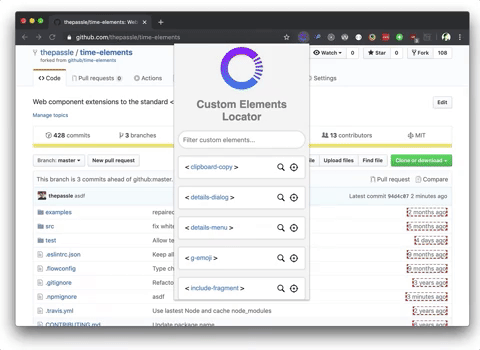

# Custom Elements Locator

## Instructions

- Write code
- Run `npm run build`
- Go to chrome://extensions/
- Toggle 'Developer mode' in top right corner
- Click 'Load unpacked' in top left corner
- Select the root folder of this project
